# Rapport de Stage

## Conception et Développement d'une Plateforme Web de Gestion de Transport Interurbain

### Rahimo Transport — Système intégré de réservation, gestion de flotte, RH, comptabilité et sécurité

---

**Présenté par :** NABA Palipouguini Albert
**Structure d'accueil :** Rahimo Transport SA
**Période :** [Date début] — [Date fin]
**Année académique :** [Année]

---

## Table des matières

- [Chapitre 1 : Présentation des structures d'accueil et de formation](#chapitre-1--présentation-des-structures-daccueil-et-de-formation)
- [Chapitre 2 : Analyse et conception](#chapitre-2--analyse-et-conception)
    - [I. Étude préalable](#i-étude-préalable)
    - [II. Expression des besoins](#ii-expression-des-besoins)
    - [III. Conception globale](#iii-conception-globale)
    - [IV. Réalisation](#iv-réalisation)
- [Chapitre 3 : Bilan du stage](#chapitre-3--bilan-du-stage)

---

## Chapitre 1 : Présentation des structures d'accueil et de formation

### 1.1 Présentation de Rahimo Transport SA

Rahimo Transport est une compagnie de transport interurbain basée au Burkina Faso, spécialisée dans le transport de passagers et de colis sur les principaux axes du pays (Ouagadougou, Bobo-Dioulasso, etc.). Forte de plusieurs années d'expérience, la compagnie dessert quotidiennement des milliers de passagers et gère une flotte de véhicules variée incluant des bus standards et VIP.

**Secteurs d'activité :**
- Transport de passagers (réservation de billets)
- Envoi et suivi de colis
- Services annexes : parking, location de véhicules, hébergement, transport de motos
- Gestion des réclamations et objets trouvés

### 1.2 Présentation de l'établissement de formation

Institut Burkinabè des Arts et Métiers (IBAM)

### 1.3 Organisation du stage

Le stage s'est déroulé sur une période de [X] mois, au sein de la direction des systèmes d'information de Rahimo Transport. L'objectif principal était de concevoir et développer une plateforme web complète de gestion intégrée, remplaçant les outils manuels et disparates utilisés jusqu'alors.

---

## Chapitre 2 : Analyse et conception

---

## I. Étude préalable

### 1. Présentation du thème

#### Problématique

Avant ce projet, Rahimo Transport gérait ses opérations de manière fragmentée :
- Réservations faites manuellement au guichet (papier)
- Suivi de flotte inexistant en temps réel
- Gestion RH (paie, congés, pointage) sur fichiers Excel
- Comptabilité tenue sans outil centralisé
- Absence de traçabilité des colis pour les clients
- Aucune plateforme de vente en ligne
- Sécurité des passagers non digitalisée

Cette situation engendrait :
- Des pertes de temps et d'argent
- Une absence de visibilité sur les indicateurs clés
- Des erreurs humaines fréquentes
- Une insatisfaction croissante des clients

#### Résultat attendu

La plateforme **Rahimo Transport** devait fournir :
- Un **site client** moderne permettant la recherche, réservation et paiement de billets en ligne
- Un **back-office** complet couvrant la gestion de flotte, les RH, la comptabilité, la sécurité et les rapports
- Une **application mobile** (optionnelle) pour les conducteurs et agents
- Une **interface de suivi en temps réel** (GPS, alertes, pointage)

### 2. Méthode d'analyse et conception

La méthode utilisée pour ce projet est **UML (Unified Modeling Language)** pour la modélisation, associée à une approche **itérative et incrémentale** pour le développement.

Les diagrammes UML utilisés :
- Diagramme de cas d'utilisation
- Diagramme de séquence
- Diagramme de classes
- Diagramme de déploiement

Le développement a suivi un cycle en **8 phases** (LOT 1-4 + Phases A-H) livrées séquentiellement.

### 3. Groupe de travail

| Rôle | Responsabilité |
|------|----------------|
| [Stagiaire] | Analyse, conception, développement full-stack, déploiement |
| [Maître de stage] | Supervision, validation des choix techniques, recette |
| [Équipe métier] | Recueil des besoins, tests utilisateur |

### 4. Planning de réalisation

| Phase | Contenu | Durée |
|-------|---------|-------|
| LOT 1 | Design System "Kinetic Horizon", tokens, composants, sidebar, header, footer | 2 semaines |
| LOT 2 | Site client : recherche, réservation, colis, services, dashboard client | 4 semaines |
| LOT 3 | Back-office avancé : dashboard recharts, notifications, maintenance, planning, GPS | 3 semaines |
| LOT 4 | RH avancé, comptabilité, sécurité/police + bugfix | 4 semaines |
| Phase A | Alertes excès de vitesse GPS | 1 semaine |
| Phase B | Formations e-learning CRUD + certificats PDF | 1 semaine |
| Phase C | Rapports avancés (YoY, Excel, date range, recharts) | 1 semaine |
| Phase D | Interface Police + vérification silencieuse | 1 semaine |
| Phase E | Paiements réels (Orange Money, Moov Money, CB) | 1 semaine |
| Phase F | Gestion des bagages (enregistrement, scan) | 1 semaine |
| Phase G | Anti-fraude (rapprochement tickets vs embarqués) | 1 semaine |
| Phase H | Multi-gares + multi-compagnies | 1 semaine |
| Tests & Documentation | Tests unitaires (66 tests), manuel administrateur | 1 semaine |

---

## II. Expression des besoins

### 2.1 Description du thème

Le projet Rahimo Transport vise à digitaliser l'ensemble des opérations d'une compagnie de transport interurbain. Le système doit permettre :

**Côté client (site public) :**
- Recherche de voyages par ville départ/arrivée et date
- Visualisation de la disposition des sièges et sélection
- Réservation avec paiement (cash, Orange Money, Moov Money, CB)
- Annulation, réorganisation, changement de siège
- Téléchargement de billet PDF
- Partage WhatsApp du billet
- Envoi et suivi de colis (avec timeline et photos)
- Accès aux services : parking, location, hébergement, transport moto
- Soumission de réclamations et déclaration d'objets trouvés

**Côté back-office :**
- Dashboard avec KPI temps réel (revenus, trajets, passagers)
- Gestion complète de la flotte (véhicules, maintenance, GPS)
- Planning conducteurs (tableau 21 jours)
- Embarquement par QR code
- RH : personnel, contrats, congés, pointage, paie avec génération de bulletins PDF
- Comptabilité : factures, grand-livre, bilan/P&L, budgets
- Sécurité : alertes police, incidents, manifestes passagers
- Formations e-learning avec quiz et certificats PDF
- Rapports avancés avec exports Excel/CSV
- Anti-fraude : détection d'anomalies tickets vs embarqués
- Multi-gares et multi-compagnies

### 2.2 Spécifications fonctionnelles

#### 2.2.1 Identification des acteurs et cas d'utilisation

| Acteur | Rôle |
|--------|------|
| **Client** | Utilisateur non connecté ou connecté, effectue des réservations |
| **Directeur Général** | Supervise l'ensemble du système, accès à tous les modules |
| **Responsable Flotte** | Gère la flotte, la maintenance, le planning conducteurs, la carte GPS |
| **Comptable** | Gère la comptabilité, les factures, le grand-livre, les budgets |
| **Chef de Gare** | Supervise les opérations de la gare, la caisse, les rapports |
| **Guichetière** | Opérateur au guichet, vend des tickets, gère les colis |
| **Agent Police** | Effectue les vérifications de sécurité, consulte la watchlist |
| **Bagagiste** | Enregistre et scanne les bagages, gère les manifests |
| **Chauffeur** | Consulte ses trajets, embarque les passagers, suit les formations |

#### 2.2.2 Diagramme de cas d'utilisation

```mermaid
graph TD
    Client -->|Réserve un billet| RechercheTrajet
    Client -->|Consulte ses réservations| DashboardClient
    Client -->|Envoie un colis| EnvoiColis
    Client -->|Utilise un service| ServicesAnnexes
    
    DirecteurGeneral -->|Gère la flotte| GestionFlotte
    DirecteurGeneral -->|Gère les RH| GestionRH
    DirecteurGeneral -->|Gère les formations| GestionFormations
    DirecteurGeneral -->|Surveille la sécurité| SecuritePolice
    DirecteurGeneral -->|Consulte tous les rapports| Rapports
    
    ResponsableFlotte -->|Planifie la maintenance| Maintenance
    ResponsableFlotte -->|Gère la flotte| GestionFlotte
    ResponsableFlotte -->|Consulte la carte GPS| CarteGPS
    
    Comptable -->|Gère la comptabilité| GestionCompta
    Comptable -->|Consulte les rapports| Rapports
    
    ChefGarde -->|Supervise la caisse| Caisse
    ChefGarde -->|Génère des rapports| Rapports
    
    Guichetiere -->|Enregistre une réservation| Guichet
    Guichetiere -->|Scanne un embarquement| Embarquement
    Guichetiere -->|Enregistre un colis| EnvoiColis
    
    AgentPolice -->|Vérifie les voyageurs| Verification
    AgentPolice -->|Consulte la watchlist| Surveillance
    
    Bagagiste -->|Enregistre un bagage| Bagage
    Bagagiste -->|Scanne un bagage| ScanBagage
    
    Chauffeur -->|Consulte ses trajets| MesTrajets
    Chauffeur -->|Suit les formations| Formations
```



#### 2.2.3 Description des cas d'utilisation principaux

**UC-01 : Rechercher un trajet**
- **Acteur :** Client
- **Précondition :** Aucune
- **Scénario nominal :**
  1. Le client saisit la ville de départ, la ville d'arrivée et la date
  2. Le système affiche les trajets disponibles (heure, prix, places)
  3. Le client peut filtrer par type de bus (VIP/Standard), prix max, plage horaire
- **Postcondition :** Liste des trajets affichée

**UC-02 : Réserver un billet**
- **Acteur :** Client
- **Précondition :** Un trajet a été sélectionné
- **Scénario nominal :**
  1. Le client sélectionne ses sièges sur le plan du bus
  2. Il saisit ses informations (nom, téléphone, email)
  3. Il choisit le mode de paiement (cash, Orange Money, Moov Money, CB)
  4. Le système crée la réservation et diminue le nombre de places disponibles
- **Postcondition :** Réservation confirmée, billet généré

**UC-03 : Gérer la paie**
- **Acteur :** Directeur Général
- **Précondition :** Employés et contrats existants
- **Scénario nominal :**
  1. Le DG clique "Générer la paie du mois"
  2. Le système calcule pour chaque employé : salaire brut, déductions (5 %), taxe (1 %), CNSS (3,5 %), net
  3. Le bulletin est stocké et peut être téléchargé en PDF
- **Postcondition :** Paie générée

**UC-04 : Vérifier un passager (Police)**
- **Acteur :** Agent Police
- **Précondition :** Watchlist renseignée
- **Scénario nominal :**
  1. L'agent saisit le nom du passager (et optionnellement le téléphone)
  2. Le système vérifie silencieusement contre la liste de surveillance
  3. Si correspondance, une alerte discrète est affichée à l'agent uniquement
- **Postcondition :** Log de vérification créé

#### 2.2.4 Diagrammes de séquence (UC importants)

**Séquence : Réservation d'un billet**

```
Client → Système : Recherche trajet (ville départ, arrivée, date)
Système → Base de données : SELECT * FROM trips WHERE ...
Base de données → Système : Résultats
Système → Client : Liste des trajets disponibles

Client → Système : Sélectionne un trajet
Système → Base de données : SELECT sièges disponibles
Base de données → Système : Plan du bus
Système → Client : Disposition des sièges

Client → Système : Choisit ses sièges + informations
Système → Base de données : INSERT INTO bookings
Système → Base de données : UPDATE trips SET available_seats -= n
Système → Passerelle Paiement : Demande de paiement (optionnel)
Système → Client : Confirmation + billet
```

**Séquence : Génération de la paie**

```
Directeur Général → Système : Générer paie (mois)
Système → Base de données : SELECT users avec contrats actifs
Base de données → Système : Liste des employés
Système → Pour chaque employé :
    Système → Base de données : Récupérer pointage, congés
    Système → Calcul : brut − déductions − taxe − CNSS = net
    Système → Base de données : INSERT INTO pay_slips
Système → Directeur Général : Paie générée avec succès
```

### 2.3 Spécifications techniques

#### 2.3.1 Matériel et logiciel existant

**Avant le projet :**
- **Matériel :** Postes de travail sous Windows, serveur physique partagé
- **Logiciel :** Suite Office (Excel pour la comptabilité et RH), cahiers physiques pour les réservations, téléphone pour la communication interne
- **Base de données :** Aucune base centralisée

#### 2.3.2 Architecture du système existant

L'ancien système était un ensemble de processus manuels et de fichiers déconnectés les uns des autres. Chaque service (guichet, RH, comptabilité, flotte) fonctionnait en silo, sans partage de données en temps réel.

#### 2.3.3 Diagnostic du système existant

| Critère | Force | Faiblesse |
|---------|-------|-----------|
| Coût | Faible investissement logiciel | Coût caché des erreurs et du temps perdu |
| Flexibilité | — | Aucune évolutivité |
| Sécurité | — | Données non protégées, pertes fréquentes |
| Productivité | — | Saisies multiples, redondances |

#### Ébauche des choix technologiques

| Technologie | Choix retenu | Justification |
|-------------|-------------|---------------|
| Langage backend | PHP 8.2 | Maturité, écosystème Laravel, hébergement économique |
| Framework | Laravel 11 | Productivité, ORM Eloquent, Inertia.js, routing |
| Frontend | React + TypeScript + Vite | Performance, typage fort, écosystème riche |
| CSS/Design | Tailwind CSS + glassmorphism | Rapidité de développement, design moderne |
| Base de données | MariaDB/MySQL | Robustesse, gratuit, adapté au volume de données |
| Graphiques | Recharts | Léger, natif React, bons pour les dashboards |
| Carte GPS | Leaflet + OpenStreetMap | Gratuit, pas de clé API requise |
| Tests | PHPUnit + Laravel Dusk | Framework natif Laravel, tests navigateur |

---

## III. Conception globale

### 3.1 Diagramme de classes

Le diagramme de classes ci-dessous présente les principales entités du système et leurs relations :

```
┌──────────────────────┐       ┌──────────────────────┐
│       User           │       │      Company         │
│──────────────────────│       │──────────────────────│
│ id, name, email,     │◄──────│ id, name, slug,      │
│ phone, role,         │       │ registration_number, │
│ company_id           │       │ is_active            │
│──────────────────────│       └──────────────────────┘
│ bookings()           │                │
│ tripsAsDriver()      │                │
│ company()            │                │
└──────────────────────┘                │
         ▲                              │
         │ ┌──────────────────────┐     │
         │ │      Vehicle         │     │
         │ │──────────────────────│─────│
         │ │ id, registration,    │     │
         │ │ brand, model,        │     │
         │ │ capacity, type,      │     │
         │ │ status, company_id   │     │
         │ │──────────────────────│     │
         │ │ locations()          │     │
         │ │ maintenanceRecords() │     │
         │ │ company()            │     │
         │ └──────────────────────┘     │
         │        1                    │
         │        │                    │
         │        │ *                  │
         │ ┌──────────────────────┐     │
         │ │       Trip           │     │
         │ │──────────────────────│─────│
         │ │ id, trip_number,     │     │
         │ │ departure_city,      │     │
         │ │ arrival_city, price, │     │
         │ │ status, company_id,  │     │
         │ │ departure_station_id │     │
         │ │──────────────────────│     │
         │ │ bookings()           │     │
         │ │ vehicle()            │     │
         │ │ company()            │     │
         │ └──────────────────────┘     │
         │             1               │
         │             │               │
         │             │ *             │
         │ ┌──────────────────────┐     │
         │ │      Booking         │     │
         │ │──────────────────────│─────│
         │ │ id, booking_number,  │     │
         │ │ passenger_name,      │     │
         │ │ seat_numbers,        │     │
         │ │ total_price, status, │     │
         │ │ company_id           │     │
         │ │──────────────────────│     │
         │ │ payment()            │     │
         │ │ trip()               │     │
         │ │ company()            │     │
         │ └──────────────────────┘     │
         │             1               │
         │             │               │
         │             │ 0..1          │
         │ ┌──────────────────────┐     │
         │ │      Payment         │     │
         │ │──────────────────────│─────│
         │ │ id, amount, method,  │     │
         │ │ transaction_id,      │     │
         │ │ status, company_id   │     │
         └──────────────────────┘     │
                                       │
┌──────────────────────┐    ┌──────────────────────┐
│      Station         │    │   StationRoute        │
│──────────────────────│    │──────────────────────│
│ id, name, city,      │◄───│ departure_station_id, │
│ type, latitude,      │───►│ arrival_station_id,  │
│ longitude, is_active │    │ route_name,          │
└──────────────────────┘    │ base_price,          │
                            │ company_id           │
                            └──────────────────────┘

┌──────────────────────┐    ┌──────────────────────┐
│    SpeedAlert         │    │   FraudCheck          │
│──────────────────────│    │──────────────────────│
│ id, vehicle_id,      │    │ id, trip_id,          │
│ speed, speed_limit,  │    │ type, severity,       │
│ level, status        │    │ status, description   │
│──────────────────────│    └──────────────────────┘
│ logs()               │
└──────────────────────┘

┌──────────────────────┐    ┌──────────────────────┐
│     Course            │    │   Certificate         │
│──────────────────────│    │──────────────────────│
│ id, titre, categorie, │    │ id, user_id,         │
│ difficulte, durée,   │───►│ course_id,            │
│ obligatoire, video   │    │ certificate_number,  │
│──────────────────────│    │ score, pdf_path      │
│ quizzes()            │    └──────────────────────┘
└──────────────────────┘

┌──────────────────────┐    ┌──────────────────────┐
│     Baggage           │    │   WatchlistEntry      │
│──────────────────────│    │──────────────────────│
│ id, tag_number,       │    │ id, full_name,       │
│ passenger_name, type, │    │ phone, id_card,      │
│ weight, status        │    │ reason, status       │
│──────────────────────│    └──────────────────────┘
│ trip(), booking()     │
└──────────────────────┘
```

### 3.2 Diagramme de séquence (conception détaillée)

**Séquence : Paiement Orange Money**

```
Client → Système : Paiement Orange Money
Système → PaymentService : charge('orange_money', params)
PaymentService → OrangeMoneyGateway : authenticate()
OrangeMoneyGateway → API Orange : POST /oauth/v2/token
API Orange → OrangeMoneyGateway : access_token
OrangeMoneyGateway → API Orange : POST /orange-money-webpay/v1/payment
API Orange → OrangeMoneyGateway : pay_token
OrangeMoneyGateway → PaymentService : PaymentResult(success=true)
PaymentService → Système : Résultat
Système → Base de données : INSERT INTO payments
Système → Client : Paiement initié, en attente de confirmation
...
API Orange → Système : Webhook POST /webhook/orange-money
Système → Base de données : UPDATE payments SET status='completed'
```

**Séquence : Scan de bagage**

```
Agent → Système : Scan tag (tag_number, action='load')
Système → Base de données : SELECT * FROM baggage WHERE tag_number = X
Système → UPDATE baggage SET status='loaded', loaded_at=now()
Système → Agent : Succès (statut mis à jour)
```

### 3.3 Diagramme d'état-transition

**États d'une réservation :**

```
┌─────────┐     ┌───────────┐     ┌──────────┐
│ Pending  │────►│ Confirmed │────►│ Boarded  │
└─────────┘     └───────────┘     └──────────┘
      │               │                │
      │               ▼                │
      │         ┌───────────┐          │
      └────────►│ Cancelled │          │
                └───────────┘          │
                                       ▼
                                ┌──────────┐
                                │Completed │
                                └──────────┘
```

**États d'un bagage :**

```
┌────────────┐     ┌──────────┐     ┌────────┐     ┌────────────┐     ┌────────────┐     ┌───────────┐
│ Registered │────►│ Scanned  │────►│ Loaded │────►│ In Transit │────►│ Unloaded   │────►│ Delivered │
└────────────┘     └──────────┘     └────────┘     └────────────┘     └────────────┘     └───────────┘
                                                                                              │
                                                                                              ▼
                                                                                        ┌──────────┐
                                                                                        │   Lost   │
                                                                                        └──────────┘
```

### 3.4 Diagramme de déploiement

```
┌─────────────────────────────────────────────────┐
│                  Client (Navigateur)              │
│  ┌───────────────────────────────────────────┐  │
│  │  Application React + Inertia.js            │  │
│  │  - Site client (pages publiques)           │  │
│  │  - Back-office (pages admin)               │  │
│  │  - Composants recharts, Leaflet            │  │
│  └───────────────────────────────────────────┘  │
└─────────────────────┬───────────────────────────┘
                      │ HTTP / HTTPS
                      ▼
┌─────────────────────────────────────────────────┐
│              Serveur Web (Nginx)                 │
│  ┌───────────────────────────────────────────┐  │
│  │  Assets statiques (build Vite)             │  │
│  │  /public/build/...                         │  │
│  └───────────────────────────────────────────┘  │
└─────────────────────┬───────────────────────────┘
                      │ Pass-through PHP-FPM
                      ▼
┌─────────────────────────────────────────────────┐
│          Application Laravel (PHP 8.2)           │
│  ┌───────────────────────────────────────────┐  │
│  │  Contrôleurs (API + Inertia)               │  │
│  │  Services (Paiement, Notifications)        │  │
│  │  Middleware (Auth, Rôles)                  │  │
│  │  ┌──────────────────────────────────┐     │  │
│  │  │  Couche Métier                   │     │  │
│  │  │  - PaymentService                │     │  │
│  │  │  - OrangeMoneyGateway            │     │  │
│  │  │  - MoovMoneyGateway              │     │  │
│  │  │  - LogPaymentGateway             │     │  │
│  │  └──────────────────────────────────┘     │  │
│  └───────────────────────────────────────────┘  │
└─────────────────────┬───────────────────────────┘
                      │ MySQL/MariaDB
                      ▼
┌─────────────────────────────────────────────────┐
│         Base de données MariaDB                  │
│  Tables : users, trips, vehicles, bookings,      │
│  payments, courses, quizzes, certificates,       │
│  baggage, fraud_checks, speed_alerts,            │
│  companies, stations, station_routes,            │
│  watchlist_entries, police_check_logs,           │
│  contracts, leaves, attendance, pay_slips,       │
│  invoices, journal_entries, budgets,             │
│  police_alerts, incident_reports, ... (34+ tbls)│
└─────────────────────────────────────────────────┘
```

---

## IV. Réalisation

### 4.1 Choix des outils de réalisation

| Catégorie | Outil | Version |
|-----------|-------|---------|
| Langage backend | PHP | 8.2 |
| Framework backend | Laravel | 11.x |
| Langage frontend | TypeScript | 5.x |
| Framework frontend | React | 18.x |
| Build tool | Vite | 5.x |
| CSS | Tailwind CSS | 3.x |
| Base de données | MariaDB | 11.x |
| Graphiques | Recharts | 2.x |
| Carte | Leaflet | 1.x |
| PDF | barryvdh/laravel-dompdf | 3.x |
| Excel | maatwebsite/laravel-excel | 3.x |
| Tests | PHPUnit | 11.x |

### 4.2 Architecture MVC de l'application

**Couche client (présentation)** — React + Inertia.js :
- Pages Inertia rendues côté serveur, hydratées côté client
- Composants React pour l'interactivité (sélection de sièges, cartes GPS, graphiques)
- Routing côté client via Inertia (pas d'API REST manuelle)

**Couche métier (contrôleurs)** — Laravel :
- 19 contrôleurs organisés par domaine :
  - `Controllers/` : TripController, BookingController, FleetController, FinanceController, SecurityController, RhController, LearningController, ColisController, AdminController, etc.
  - `Controllers/Admin/` : AdminLearningController, ReportsController, PoliceController, PaymentController, FraudController, BaggageController, CompanyController, StationController
- Services : `Services/Payment/` (PaymentGateway interface, OrangeMoneyGateway, MoovMoneyGateway, LogPaymentGateway, PaymentService)

**Couche persistance (modèles)** — Eloquent ORM :
- 34 modèles Eloquent avec relations, scopes, accessors
- Traits réutilisables : `BelongsToCompany` (filtrage multi-compagnie)
- Migrations versionnées (25 migrations)

### 4.3 Maquettes IHM

**Page d'accueil (Welcome)**
- Design "Kinetic Horizon" avec glassmorphism
- Hero section avec dégradé signature (#667eea → #764ba2)
- Barre de recherche de trajets
- Accès aux services (colis, parking, location, hébergement, moto)

**Dashboard admin**
- 6 cartes KPI (trajets, réservations, revenus, véhicules actifs, etc.)
- Graphique tendance des revenus sur 30 jours (recharts BarChart)
- Top 5 routes par revenu
- Répartition des revenus par service (PieChart)
- Derniers départs et alertes

**Page de réservation**
- Étapes : Search → SeatSelection → Checkout → Confirmation
- Plan du bus interactif avec sélection de sièges
- Récapitulatif avant confirmation

**Page RH - Paie**
- Liste des employés avec salaire brut, déductions, net
- Bouton "Générer la paie" pour tout le mois
- Téléchargement du bulletin PDF

**Page Police - Vérification silencieuse**
- Champ de saisie (nom, téléphone)
- Résultat discret (vert = OK, rouge = correspondance)
- Journal de toutes les vérifications

### 4.4 Politique de sécurité

**Pannes et sauvegarde :**
- Base de données sauvegardée quotidiennement (cron + mysqldump)
- Journalisation de toutes les actions critiques (ActivityLog)
- Rollback transactionnel pour les paiements

**Sécurité applicative :**
- Authentification via Laravel Breeze (sessions sécurisées)
- Middleware de rôle : `CheckRole` (directeur_general, responsable_flotte, comptable, chef_garde, guichetiere, agent_police, bagagiste, chauffeur, client)
- CSRF Protection (Laravel intégré)
- Validation des données côté serveur (Form Requests)
- XSS Protection (Blade + React)
- SQL Injection (Eloquent ORM : requêtes paramétrées)

**Sécurité des données :**
- Mots de passe hashés (bcrypt)
- Données sensibles en variable d'environnement (.env)
- Pas de secret dans le code source

### 4.5 Coût de réalisation

| Poste | Coût (FCFA) |
|-------|-------------|
| Hébergement serveur (1 an) | 300 000 |
| Nom de domaine (1 an) | 15 000 |
| Licence SSL (1 an) | 50 000 |
| Main-d'œuvre (stage) | 0 |
| API Orange Money (commission par transaction) | 1,5 % |
| SMS / Notifications | À définir |
| **Total estimation** | **365 000 FCFA** |

---

## Chapitre 3 : Bilan du stage

### 3.1 Bilan technique

Le projet Rahimo Transport a abouti à la livraison complète d'une plateforme web de gestion intégrée pour compagnie de transport. En chiffres :

- **25 migrations** de base de données
- **34 modèles** Eloquent
- **19 contrôleurs** (154 routes)
- **9 rôles utilisateur** (client, chauffeur, guichetiere, agent_police, bagagiste, chef_garde, comptable, responsable_flotte, directeur_general)
- **+30 pages** Inertia.js (React + TypeScript)
- **66 tests** (53 feature + 13 unit, 156 assertions)
- **0 erreur** TypeScript/PHP au build
- **Build en ~3 secondes** (Vite)

### 3.2 Compétences acquises

- Architecture Laravel avancée (services, middlewares, Inertia.js, scopes)
- Conception de systèmes multi-tenant (filtrage compagnie)
- Intégration de passerelles de paiement (API Orange Money, Moov Money)
- Génération de documents PDF (dompdf)
- Cartographie avec Leaflet/OpenStreetMap
- Graphiques avec Recharts
- Tests automatisés avec PHPUnit
- Design système avec Tailwind CSS et glassmorphism

### 3.3 Difficultés rencontrées

1. **Intégration des API de paiement** — Documentation limitée pour les API Orange Money et Moov Money, nécessité de mode sandbox
2. **Contraintes MariaDB** — Problèmes de clés étrangères (errno 168), résolus en utilisant `DB::statement` pour les contraintes
3. **Gestion multi-compagnie** — Complexité d'ajouter le filtrage `company_id` rétroactivement sur tous les contrôleurs (88 requêtes mises à jour)

### 3.4 Perspectives d'évolution

- **Déploiement production** avec credentials API réels
- **Application mobile** (React Native ou Flutter) pour les conducteurs
- **Système de fidélité** avancé avec parrainage
- **Intelligence artificielle** pour la prédiction de demande et l'optimisation des prix
- **Chatbot WhatsApp** pour la réservation automatisée

---

*Rapport généré le [Date] — Rahimo Transport SA*
